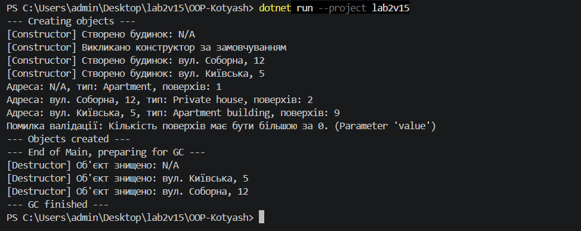

# Лабораторна робота №2

**Тема:** Клас із кількома конструкторами. Життєвий цикл об'єкта.
**Дисципліна:** Об'єктно-орієнтоване програмування
**Виконав:** Прізвище Ім'я, група
**Варіант:** 15 (клас `House`)

## Мета

Навчитися реалізовувати перевантажені конструктори, дослідити порядок їх викликів та зрозуміти основи життєвого циклу об'єкта в C#.

## Репозиторій

https://github.com/kotiashtvkn24-pixel/OOP-Kotyash/tree/main/lab2v15

## Завдання варіанту

Клас `House`:

- поля: `_address` (string), `_type` (string), `_floors` (int);
- властивості `Address`, `Type`, `Floors` (валідація: кількість поверхів > 0);
- конструктори: за замовчуванням (`Address = "N/A"`, `Type = "Apartment"`, `Floors = 1`) та параметризований;
- метод `GetHouseInfo()`, що повертає рядок з інформацією про будинок;
- деструктор (фіналізатор), який виводить повідомлення про знищення об'єкта.

## Код програми (`Program.cs`)

```csharp
using System;
using System.Runtime.CompilerServices;

namespace Lab2v15
{
    public class House
    {
        private string _address = "N/A";
        private string _type = "Apartment";
        private int _floors = 1;

        public string Address
        {
            get => _address;
            set => _address = string.IsNullOrWhiteSpace(value) ? "N/A" : value;
        }

        public string Type
        {
            get => _type;
            set => _type = string.IsNullOrWhiteSpace(value) ? "Apartment" : value;
        }

        public int Floors
        {
            get => _floors;
            set
            {
                if (value <= 0)
                    throw new ArgumentOutOfRangeException(
                        nameof(value), "Кількість поверхів має бути більшою за 0.");
                _floors = value;
            }
        }

        public House(string address, string type, int floors)
        {
            Address = address;
            Type = type;
            Floors = floors;
            Console.WriteLine($"[Constructor] Створено будинок: {_address}");
        }

        public House() : this("N/A", "Apartment", 1)
        {
            Console.WriteLine("[Constructor] Викликано конструктор за замовчуванням");
        }

        public string GetHouseInfo()
        {
            return $"Адреса: {_address}, тип: {_type}, поверхів: {_floors}";
        }

        ~House()
        {
            Console.WriteLine($"[Destructor] Об'єкт знищено: {_address}");
        }
    }

    internal class Program
    {
        [MethodImpl(MethodImplOptions.NoInlining)]
        static void CreateAndUseObjects()
        {
            House house1 = new House();
            House house2 = new House("вул. Соборна, 12", "Private house", 2);
            House house3 = new House("вул. Київська, 5", "Apartment building", 9);

            Console.WriteLine(house1.GetHouseInfo());
            Console.WriteLine(house2.GetHouseInfo());
            Console.WriteLine(house3.GetHouseInfo());

            try
            {
                house1.Floors = 0;
            }
            catch (ArgumentOutOfRangeException ex)
            {
                Console.WriteLine($"Помилка валідації: {ex.Message}");
            }
        }

        static void Main(string[] args)
        {
            Console.WriteLine("--- Creating objects ---");
            CreateAndUseObjects();
            Console.WriteLine("--- Objects created ---");

            Console.WriteLine("--- End of Main, preparing for GC ---");
            GC.Collect();
            GC.WaitForPendingFinalizers();
            GC.Collect();
            Console.WriteLine("--- GC finished ---");
        }
    }
}
```

## Результат виконання

Запуск: `dotnet run -c Release --project lab2v15`



Текстовий вивід:

```text
--- Creating objects ---
[Constructor] Створено будинок: N/A
[Constructor] Викликано конструктор за замовчуванням
[Constructor] Створено будинок: вул. Соборна, 12
[Constructor] Створено будинок: вул. Київська, 5
Адреса: N/A, тип: Apartment, поверхів: 1
Адреса: вул. Соборна, 12, тип: Private house, поверхів: 2
Адреса: вул. Київська, 5, тип: Apartment building, поверхів: 9
Помилка валідації: Кількість поверхів має бути більшою за 0. (Parameter 'value')
--- Objects created ---
--- End of Main, preparing for GC ---
[Destructor] Об'єкт знищено: N/A
[Destructor] Об'єкт знищено: вул. Київська, 5
[Destructor] Об'єкт знищено: вул. Соборна, 12
--- GC finished ---
```

## Висновок

У ході роботи реалізовано клас `House` з двома перевантаженими конструкторами. Конструктор за замовчуванням через `: this(...)` викликає параметризований, тому код ініціалізації не дублюється. Валідація у властивості `Floors` не дозволяє встановити некоректну кількість поверхів (перевірено виняткам `ArgumentOutOfRangeException`).

Життєвий цикл об'єкта складається зі створення (`new` виділяє пам'ять у купі й викликає конструктор), використання та знищення. Коли на об'єкт не лишається посилань, збирач сміття позначає його як придатний до видалення й перед звільненням пам'яті викликає фіналізатор. Момент виклику та порядок фіналізаторів недетерміновані: у виводі вони йдуть не в порядку створення. Щоб об'єкти гарантовано стали недосяжними, вони створюються в окремому методі, після завершення якого посилань на них не залишається.

У реальних програмах для звільнення ресурсів краще використовувати `IDisposable`, а `GC.Collect()` вручну не викликати. Тут він застосований лише для навчальної демонстрації.

## Відповіді на контрольні запитання

1. **Що таке перевантаження конструкторів і яку перевагу воно дає?** Це кілька конструкторів в одному класі, які відрізняються кількістю або типами параметрів. Вони дають змогу створювати об'єкти різними, гнучкішими способами.
2. **Як `: this()` дозволяє уникнути дублювання коду?** Один конструктор передає керування іншому конструктору того ж класу, тож уся ініціалізація зосереджена в одному місці.
3. **Хто і в який момент викликає деструктор?** Його викликає збирач сміття (у окремому потоці фіналізації) перед звільненням пам'яті об'єкта. Точний момент заздалегідь невідомий.
4. **Чому не рекомендується викликати `GC.Collect()` вручну?** Збирач сам обирає оптимальний момент. Ручний виклик погіршує продуктивність, призупиняє потоки програми й може передчасно переводити об'єкти в старші покоління.
